# Anjali Dahiya
👩‍💻 Salesforce Consultant & Architect | 25x Salesforce-Certified | CRM & Vlocity Specialist

📍 Hamburg, Germany  
📧 [anjali.dahiya16@yahoo.com](mailto:anjali.dahiya16@yahoo.com)  
🔗 [LinkedIn](https://www.linkedin.com/in/anjali16) | [Personal Website](https://www.anjali-dahiya.com) | [Xing Profile](https://www.xing.com/profile/Anjali_Dahiya4)

---

## 🌟 About Me
I am a results-driven Salesforce Consultant with over a decade of IT experience. I specialize in designing, implementing, and optimizing Salesforce solutions to drive business success, with expertise across multiple Salesforce products and industry-specific applications.

- **25x Salesforce Certified**, including Platform App Builder, Advanced Administrator, and Application Architect.
- Proficient in **Vlocity**, **Einstein Analytics**, and **Omnistudio**.
- Skilled in **Apex**, **Visualforce**, **JavaScript**, and modern front-end frameworks.
- Multilingual: English (Professional), German (Elementary), Hindi (Native).

---

## 🏆 Certifications

### **Recent Certifications**
- **Salesforce Certified AI Specialist** (Oct 2024)  
  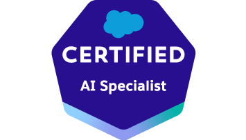

- **Salesforce Certified Data Cloud Consultant** (Sep 2024)  
  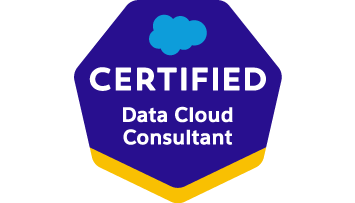

- **Salesforce Certified B2B Solution Architect** (Dec 2023)  
  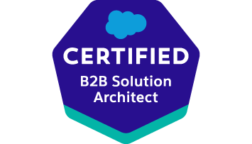

- **Salesforce Certified AI Associate** (Sep 2023)  
  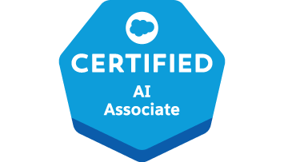

- **Salesforce Certified CPQ Specialist** (Aug 2023)  
  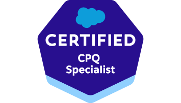

---

### **Key Architect and Consultant Certifications**
- **Salesforce Certified OmniStudio Consultant** (May 2023)  
  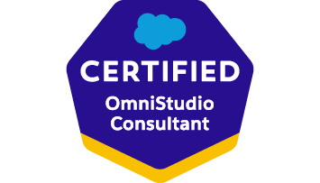

- **Salesforce Certified Development Lifecycle and Deployment Architect** (Apr 2023)  
  

- **Salesforce Certified System Architect** (Apr 2023)  
  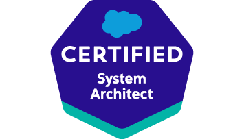

- **Salesforce Certified Identity and Access Management Architect** (Apr 2023)  
  

- **Salesforce Certified Integration Architect** (Apr 2023)  
  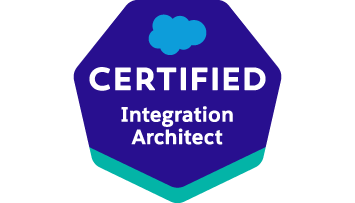

---

### **Accredited Certifications**
- **Security & Privacy Accredited Professional**  
  _Issued: March 19, 2023_  
  

- **Financial Services Cloud Accredited Professional**  
  _Issued: March 31, 2023_  
  

- **Einstein Prediction Builder Accredited Professional**  
  _Issued: July 16, 2021_  
  

---

### **Developer and Foundational Certifications**
- **Salesforce Certified Platform Developer II** (May 2020)  
  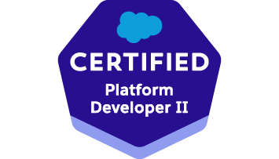

- **Salesforce Certified Platform Developer I** (Apr 2020)  
  

- **Salesforce Certified Sales Cloud Consultant** (Jul 2016)  
  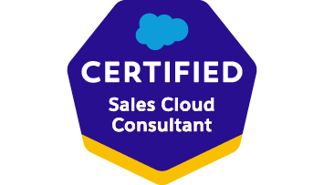

- **Salesforce Certified Advanced Administrator** (Jun 2015)  
  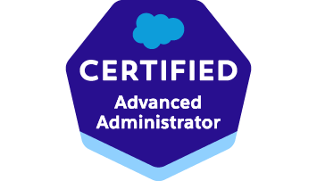

- **Salesforce Certified Administrator** (Sep 2014)  
  

---

### 💼 Professional Experience
- **Sr. Technical Consultant @ Statista** (2024 - Present)  
  Leading Salesforce architecture and mentoring teams to implement scalable CRM solutions.

- **Solution Architect @ Hanse CRM GmbH** (2018 - 2024)  
  Designed and deployed Salesforce Sales/Service Cloud solutions while collaborating with stakeholders to refine project backlogs.

- **Salesforce Demo Engineer @ Salesforce** (2015 - 2017)  
  Delivered 500+ demos globally, showcasing Salesforce capabilities and building proof-of-concept applications.

---

## 🛠 Skills
### **Salesforce Expertise**
- CRM Solutions: Sales Cloud, Service Cloud, Marketing Cloud  
- Development: Apex, Visualforce, Lightning Web Components (LWC)  
- Integration: REST/SOAP APIs, Vlocity CPQ, Omnistudio  
- Analytics: Tableau CRM, Einstein Analytics  

### **Technical Skills**
- Programming: JavaScript, HTML, CSS, AngularJS  
- Deployment: CI/CD, GitHub Actions  
- Tools: VS Code, Salesforce DX, Tableau  

---

## 📊 Analytics Portfolio
Explore my [Tableau portfolio](https://public.tableau.com/app/profile/anjali.dahiya) for examples of interactive dashboards and visualizations.

---

## 🚀 Career Inspiration
_"Striving to empower businesses through innovative Salesforce solutions, driving operational efficiency, and fostering growth."_

---
